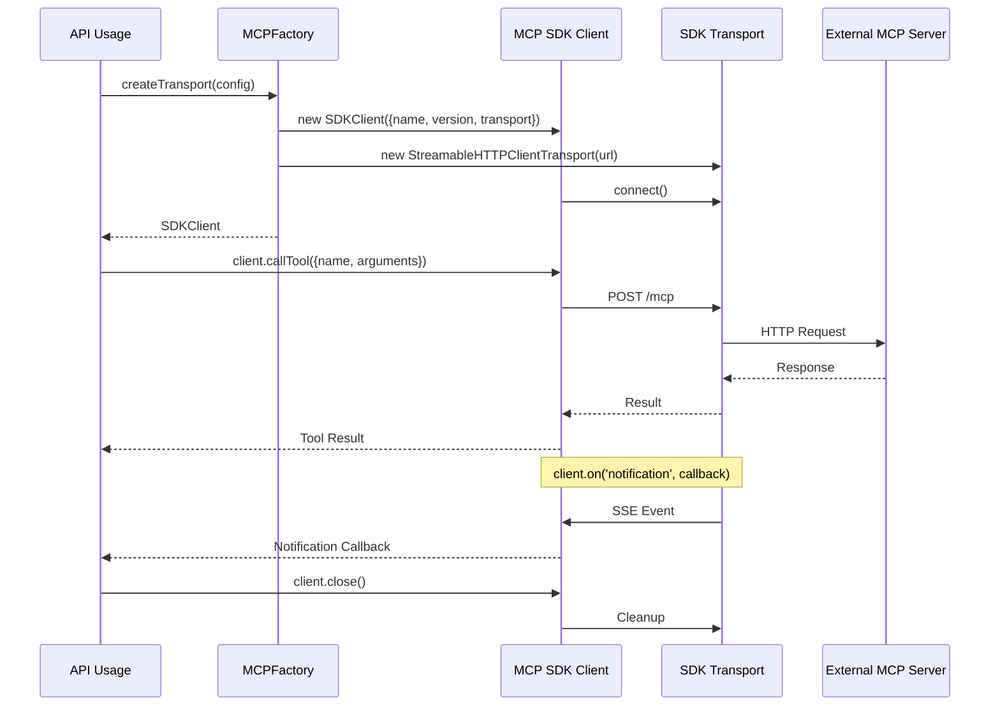

# MCP Integration Architecture (Completed Refactor)

## Overview
The MCP subfolder has been refactored to use the official MCP TypeScript SDK (@modelcontextprotocol/sdk) directly. Custom transports, wrappers, and types have been removed, relying on the SDK for all protocol handling, including Streamable HTTP and Stdio transports, session management, OAuth, and JSON-RPC schemas.

Key changes:
- **Simplified Structure**: Only `factory.mts` remains, exporting `createTransport` which returns an SDKClient instance.
- **Direct SDK Usage**: No custom interfaces; use SDK methods like `client.callTool`, `client.readResource`, `client.on('notification')`.
- **Dependencies**: SDK added to `packages/api/package.json`; custom files (`client.mts`, `types.mts`, `transports/*.mts`) deleted.
- **Backward Compatibility**: Factory signature preserved (TransportConfig), but returns SDKClient instead of custom MCPTransport. No external usages found, so no breaking changes.

Principles:
- **Modularity**: Factory abstracts transport creation; SDK handles all protocol details.
- **Extensibility**: Leverage SDK features (e.g., resume via `client.connect({ sessionId })`).
- **Security**: SDK's built-in protections (DNS rebinding, OAuth); no hardcoded secrets.
- **Deployment**: Stateless HTTP for scaling; stdio for local.

## System Decomposition
- **Core Component**: `factory.mts` - Creates and configures SDKClient based on config (url for HTTP, command/args for stdio).
- **Interfaces**: SDK's Client API (from `@modelcontextprotocol/sdk/client`).
- **Removed**: Custom MCPTransport, types, transports (replaced by SDK equivalents).
- **Dependencies**: `@modelcontextprotocol/sdk`; align shared schemas if needed.

## Interface Design
- **Factory API**: `createTransport(config: TransportConfig): SDKClient`
  - Supports `url` (StreamableHTTPClientTransport), `command/args` (StdioClientTransport).
  - Optional `sessionId` for resume, `clientName/version`.
- **SDK Methods** (used directly):
  - Requests: `client.initialize()`, `client.callTool({name, arguments})`, `client.readResource(uri)`, `client.listTools()`, etc.
  - Notifications: `client.on('notification', callback)`.
  - Lifecycle: `client.close()`.
- **Communication**: SDK manages JSON-RPC 2.0 over HTTP (POST /mcp, SSE notifications) or stdio.
- **Errors**: SDK's MCPError; factory throws on invalid config.

## Data Flows
1. Import `createTransport` from `mcp/factory`.
2. `const client = createTransport({ url: '...' })`.
3. Use SDK: `await client.initialize(); const result = await client.callTool('tool', { args });`.
4. Notifications: `client.on('notification', handler)`.
5. Close: `client.close()`.

Sequence diagram:

## Validation & Quality
- **Requirements**: Full SDK integration; transports, factory, errors covered.
- **Tests**: Updated `transports.test.mts` for SDKClient creation/initialize.
- **Non-Functional**: Scalable, secure (SDK features), observable (integrate with PostHog).
- **Failure Modes**: Handled by SDK; factory validates config.
- **Trade-offs**: SDK dependency added; custom code removed for compliance/maintainability.
- **Migration Complete**: Custom files deleted; direct SDK usage.

## Deployment
- **Runtime**: Node.js ESM; integrate via factory in server/processes.
- **Scaling**: HTTP stateless; stdio per-instance.
- **Monitoring**: SDK events to logging/analytics.

## Status
Refactor complete as of 2025-09-13. Validate with MCP servers; extend factory for future needs (e.g., OAuth config).
4. Validate with MCP server examples from SDK docs.