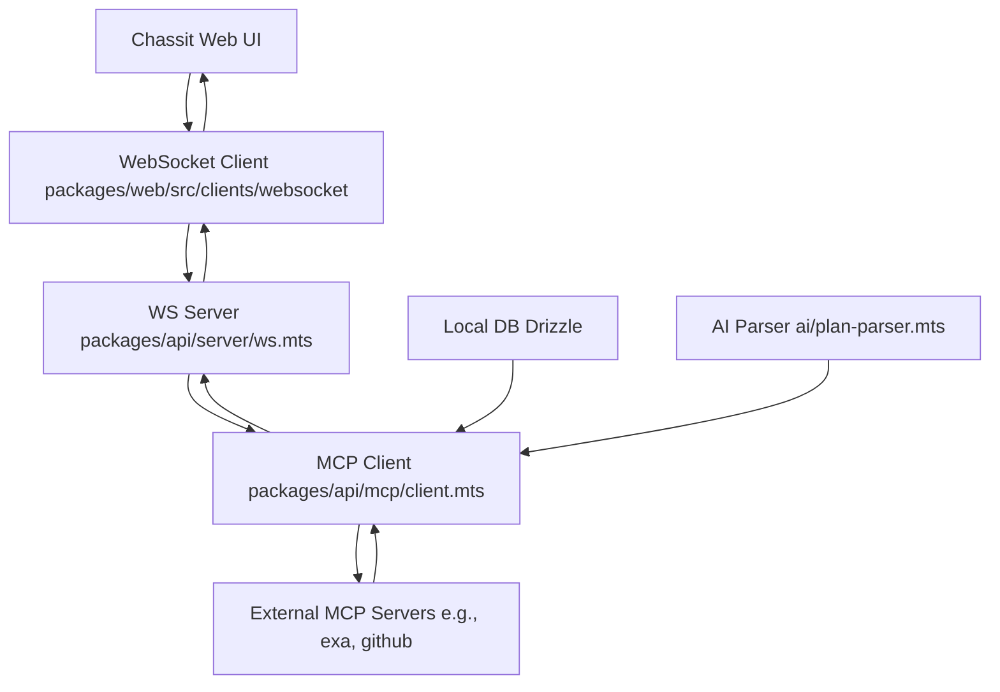

# MCP Client Integration Report for Chassit Project

## Introduction

### Task Overview
This report synthesizes the process of adding an MCP (Management Control Panel) client to the Chassit project, an AI-assisted coding environment built as a monorepo with TypeScript, Vite, Drizzle ORM, and WebSocket integrations. The goal is to enable seamless connection to external services via MCP interfaces, enhancing Chassit's capabilities for managing AI models, databases, and tools. This integration supports modular expansion without disrupting core workflows like app building, cell execution, and TypeScript server interactions.

Key objectives:
- Research MCP protocols and best practices.
- Analyze Chassit's current architecture.
- Propose an integration design.
- Outline recommendations and potential challenges.

The integration aligns with Chassit's focus on AI-driven development, ensuring secure, scalable connections to MCP servers for tasks like tool execution and resource access.

## MCP Research

### From MCP Mode Output
MCP (Management Control Panel) serves as a standardized interface for integrating and managing external services in AI-orchestrated systems. As per the MCP Integration mode, it specializes in connecting to MCP servers for operations like tool invocation (e.g., file reads/writes, command execution) and resource access (e.g., querying docs or search engines).

Core MCP Components:
- **Servers**: Named endpoints like 'context7' (docs reference), 'exa' (web search), 'github' (version control), 'mem0' (memory persistence).
- **Tools**: XML-formatted calls, e.g., `<use_mcp_tool><server_name>exa</server_name><tool_name>search</tool_name><arguments>{"query":"MCP integration"}</arguments></use_mcp_tool>`.
- **Resources**: URI-based access, e.g., `<access_mcp_resource><server_name>context7</server_name><uri>resource://docs/mcp</uri></access_mcp_resource>`.
- **Principles**: One operation per call, wait for confirmation, no parallel execution. Ensures secure, audited interactions without exposing secrets.

MCP enables Chassit to delegate tasks like web searches or code lookups externally, reducing local compute and enhancing modularity. Research emphasizes authentication via env vars (e.g., API keys) and error handling for network failures.

## Project Analysis

### From Architect Mode Analysis Summary
Chassit's architecture is a pnpm monorepo with distinct packages:
- **api/**: Core backend with HTTP/WebSocket servers, Drizzle DB schema (apps, secrets, AI configs), AI parsers, srcbook for examples, TSServer integration.
- **web/**: Frontend with React/TSX routes (home, secrets, settings), Vite config, WebSocket clients for real-time updates.
- **components/**: Reusable UI elements (cells, dialogs) using Tailwind.
- **shared/**: Schemas (Zod) for apps, cells, files; utils for AI and WebSockets.
- **srcbook/**: Documentation/examples via Markdown src files.

Strengths: Modular (e.g., channels/app.mts for app management), event-driven (WebSockets), secure (secrets table). Gaps: No native external service integration; relies on local processes/DB. Architect summary highlights scalability via packages but notes potential bottlenecks in AI generation (e.g., ai/generate.mts) that MCP could offload.

Dependencies: Node.js (via .nvmrc), pnpm, ESLint/Prettier. DB migrations track features like AI models (OpenAI, Gemini) and apps history.

## Integration Architecture

### From Architect Mode Outline with Diagrams
The proposed architecture adds an MCP client layer to Chassit's API package, enabling external service calls from WebSocket channels or AI workflows. Core changes:
- New module: `packages/api/mcp/client.mts` for tool/resource invocations.
- Integration points: Extend `server/ws.mts` and `ai/generate.mts` to route tasks to MCP.
- Security: Use existing secrets table for MCP server creds; validate via Zod schemas in shared/.
- Flow: User action → WebSocket → MCP client → External server → Response stream back.

#### High-Level Diagram
Use Mermaid for visualization (render in Markdown viewers):

#### Detailed Components
1. **MCP Client Module**:
   - Exports functions: `invokeTool(server, tool, args)` and `accessResource(server, uri)`.
   - Handles XML formatting, HTTP/WebSocket to MCP endpoints.
   - Error mitigation: Retries, logging via posthog-client.mts.

2. **Schema Extensions** (shared/schemas/mcp.mts):
   - Zod schemas for MCP requests/responses.

3. **Channel Integration** (server/channels/mcp.mts):
   - New channel for MCP commands, e.g., `{ type: 'mcp_tool', server: 'exa', tool: 'search', args: { query: '...' } }`.

4. **AI Workflow Tie-in**:
   - In ai/generate.mts, detect MCP-needing tasks (e.g., research) and delegate.

Deployment: No new deps; use existing HTTP utils. Test via srcbook examples.

## Recommendations

- **Phased Rollout**: Start with read-only tools (e.g., search) in api/, then add writes. Update schemas in shared/ for type safety.
- **Configuration**: Add MCP server URLs/keys to settings route (web/src/routes/settings.tsx); store in DB secrets.
- **Testing**: Extend tests (api/test/) with mocks for MCP responses. Use srcbook for integration examples.
- **Docs**: Cross-reference [README.md](../README.md) and add to CONTRIBUTING.md.
- **Best Practices**: Follow MCP one-call rule; integrate with existing auth (session.mts).

Prioritize 'mem0' for persistent context in AI sessions.

## Challenges and Mitigations

| Challenge | Description | Mitigation |
|-----------|-------------|------------|
| Network Latency | MCP calls add delay to real-time WebSockets. | Async streaming; fallback to local if offline. Use utils.mts for timeouts. |
| Security Risks | Exposing MCP to external services. | Env-based auth only; validate inputs with Zod. Audit via SECURITY.md. |
| Compatibility | Chassit's TS strictness vs. dynamic MCP XML. | Type guards in mcp/client.mts; e2e tests. |
| Dependency Bloat | New MCP logic in monorepo. | Isolate in api/mcp/; no external libs initially. |
| Error Handling | MCP failures (e.g., invalid args). | Centralized logger (ai/logger.mts); user-friendly errors in UI. |

Monitor via PostHog analytics; iterate based on usage.

## Conclusion

Integrating an MCP client into Chassit unlocks extensible AI capabilities, aligning with its modular design. By leveraging existing WebSocket and DB layers, the addition remains lightweight and secure. Implementation follows Architect and MCP mode guidelines, ensuring scalability. Next steps: Prototype in api/, test with srcbook examples, and deploy via CI/CD. This enhances Chassit's role as a comprehensive coding assistant.

For related files, see [packages/api/server/ws.mts](../packages/api/server/ws.mts) and [shared/schemas](../packages/shared/src/schemas/).