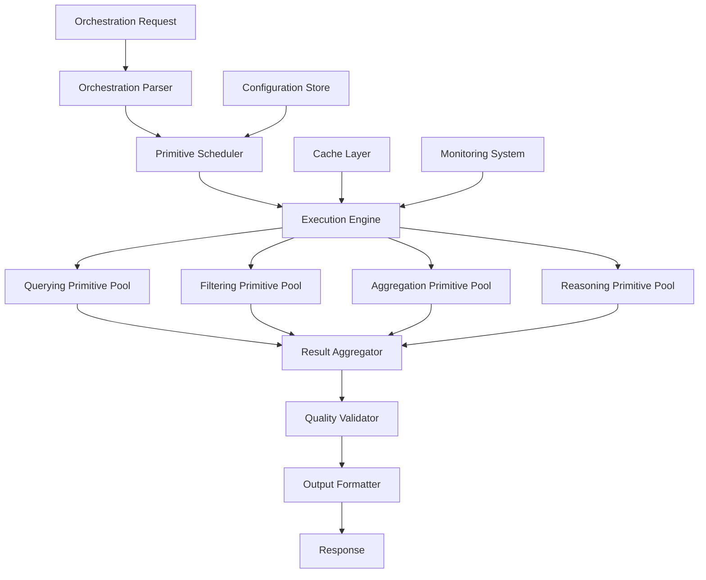

# Primitive-Based Orchestration Architecture Specification

## Executive Summary

This specification outlines the transformation of existing orchestrations in `src/resources/orchestrations/` into a composable, primitive-based architecture using the four core primitives: Querying, Filtering, Aggregation, and Reasoning. The new architecture enables modular, reusable, and scalable orchestration patterns that can be dynamically composed to meet diverse information retrieval and analysis needs.

## 1. Current Primitive Capabilities Analysis

### 1.1 Querying Primitive
**Core Function**: Strategy-based Exa search orchestration with multi-tool coordination

**Capabilities**:
- Multi-source data retrieval (web_search_exa, company_research_exa, wikipedia_search_exa, linkedin_search_exa)
- Three agentic levels: prescriptive, guided, autonomous
- Adaptive tool selection based on search context
- Quality scoring and confidence metrics
- Source attribution and metadata tracking

**Output Structure**:
```json
{
  "primitive_type": "querying",
  "results": {
    "search_results": [...],
    "metadata": {
      "total_sources": 4,
      "average_confidence": 0.78,
      "quality_score": 0.83
    }
  },
  "optimization_hints": {
    "filter_rules": [...],
    "aggregation_focus": [...]
  }
}
```

### 1.2 Filtering Primitive
**Core Function**: Flexible rule-based data filtering with quality optimization

**Capabilities**:
- Multi-rule filtering (relevance, content quality, deduplication, temporal)
- Adaptive threshold adjustment based on agentic level
- Semantic similarity deduplication
- Quality scoring and source reliability assessment
- Context-aware filtering strategies

**Filter Rule Types**:
- Relevance threshold filtering
- Content quality assessment
- Semantic deduplication
- Temporal range filtering
- Source credibility filtering

### 1.3 Aggregation Primitive
**Core Function**: Data combination and synthesis with evidence weighting

**Capabilities**:
- Multiple aggregation methods (thematic, temporal, comparative)
- Evidence-weighted synthesis
- Conflict resolution and consensus building
- Source attribution preservation
- Quality metrics calculation

**Aggregation Strategies**:
- Thematic synthesis by topic/sentiment
- Temporal analysis for trend identification
- Comparative analysis across entities
- Evidence-weighted consensus building

### 1.4 Reasoning Primitive
**Core Function**: Structured analysis and inference generation

**Capabilities**:
- Multiple reasoning frameworks (SWOT, investment analysis, competitive analysis, risk assessment)
- Advanced analytical techniques (scenario analysis, sensitivity analysis, Monte Carlo)
- Confidence-based recommendations
- Strategic implication generation
- Quality validation and consistency checking

## 2. Orchestration Pattern Analysis

### 2.1 Business Market Intelligence Patterns

#### Comprehensive Company Profile
**Current Structure**: 4-phase sequential workflow
- Phase 1: Foundation Research (parallel execution)
- Phase 2: Current State Analysis
- Phase 3: Deep Dive Areas (selective)
- Phase 4: Synthesis & Report Generation

**Primitive Mapping**:
```
Phase 1-3: Querying Primitive (guided level)
├── Query Strategy: "comprehensive company intelligence"
├── Tools: company_research_exa, wikipedia_search_exa, linkedin_search_exa, web_search_exa
└── Context: business_intelligence domain

Phase 4a: Filtering Primitive (guided level)
├── Rules: relevance_threshold, content_quality, deduplication
└── Quality threshold: 0.8

Phase 4b: Aggregation Primitive (guided level)
├── Method: thematic_synthesis
├── Grouping: ["source_type", "information_category", "temporal"]
└── Output: structured_company_profile

Phase 4c: Reasoning Primitive (guided level)
├── Framework: business_analysis
├── Objective: "comprehensive company assessment"
└── Context: investment_due_diligence
```

#### SWOT Analysis Aggregation
**Current Structure**: 6-phase comprehensive analysis
- Framework setup → Strengths discovery → Weaknesses identification → Opportunities scanning → Threats assessment → Synthesis

**Primitive Mapping**:
```
Phases 1-5: Querying Primitive (autonomous level)
├── Multi-objective search strategy
├── Competitor identification and analysis
└── Market intelligence gathering

Phase 6a: Filtering Primitive (guided level)
├── SWOT-specific filtering rules
├── Evidence quality assessment
└── Competitive relevance filtering

Phase 6b: Aggregation Primitive (autonomous level)
├── Method: comparative_analysis + thematic_synthesis
├── Evidence weighting by source credibility
└── Cross-company pattern identification

Phase 6c: Reasoning Primitive (autonomous level)
├── Framework: swot_analysis
├── Advanced features: scenario_analysis, sensitivity_analysis
└── Strategic recommendations generation
```

### 2.2 Meta-Orchestration Patterns

#### Workflow Design Research Engine
**Current Structure**: 5-phase meta-workflow research
- Domain analysis → User behavior research → Pattern analysis → Technical research → Optimization strategy

**Primitive Mapping**:
```
Each Phase: Complete Primitive Chain
├── Querying (autonomous) → domain-specific research
├── Filtering (guided) → relevance and quality filtering
├── Aggregation (autonomous) → pattern synthesis
└── Reasoning (autonomous) → strategic insights

Meta-Level Orchestration:
├── Phase results feed into next phase queries
├── Recursive improvement through self-analysis
└── Dynamic workflow generation based on findings
```

### 2.3 Knowledge Academic Research Patterns

#### Topic Literature Review
**Primitive Mapping**:
```
Querying (guided level):
├── Tools: research_paper_search_exa, wikipedia_search_exa
├── Strategy: academic_research
└── Context: literature_review

Filtering (prescriptive level):
├── Academic quality filters
├── Peer-review status filtering
└── Citation count thresholds

Aggregation (guided level):
├── Method: thematic_synthesis
├── Chronological organization
└── Evidence hierarchy construction

Reasoning (guided level):
├── Framework: literature_analysis
├── Objective: knowledge_synthesis
└── Output: comprehensive_review
```

## 3. Primitive Combination Patterns

### 3.1 Linear Chain Pattern
**Structure**: Query → Filter → Aggregate → Reason
**Use Cases**: Standard research workflows, company analysis, market intelligence
**Benefits**: Clear data flow, predictable outcomes, easy to debug

### 3.2 Parallel Branching Pattern
**Structure**: 
```
Query (multi-objective) → Multiple Filter branches → Aggregate (merge) → Reason
```
**Use Cases**: Comprehensive analysis requiring different data perspectives
**Benefits**: Faster execution, diverse data sources, comprehensive coverage

### 3.3 Iterative Refinement Pattern
**Structure**:
```
Query → Filter → Aggregate → Reason → (feedback to Query) → ...
```
**Use Cases**: Complex research requiring progressive refinement
**Benefits**: Adaptive improvement, gap filling, quality enhancement

### 3.4 Hierarchical Decomposition Pattern
**Structure**:
```
Meta-Query → Sub-queries (parallel) → Individual chains → Meta-aggregation → Meta-reasoning
```
**Use Cases**: Multi-faceted analysis, competitive intelligence, market research
**Benefits**: Scalable complexity, modular analysis, comprehensive synthesis

### 3.5 Recursive Meta-Pattern
**Structure**:
```
Primitive Chain → Self-analysis → Improved Primitive Chain → ...
```
**Use Cases**: Workflow optimization, self-improving systems
**Benefits**: Continuous improvement, adaptive optimization

## 4. Proposed Architecture Design

### 4.1 Core Architecture Principles

#### Composability
- Each primitive is a self-contained, stateless function
- Standardized input/output interfaces enable seamless chaining
- Configuration-driven behavior adaptation
- Reusable across different orchestration contexts

#### Modularity
- Clear separation of concerns between primitives
- Independent development and testing of each primitive
- Pluggable implementations for different use cases
- Version compatibility management

#### Scalability
- Horizontal scaling through parallel primitive execution
- Caching strategies for expensive operations
- Resource optimization through intelligent scheduling
- Load balancing across primitive instances

#### Observability
- Comprehensive logging and metrics collection
- Performance monitoring and optimization
- Quality tracking and improvement
- Error handling and recovery mechanisms

### 4.2 Orchestration Engine Architecture



### 4.3 Primitive Interface Specification

#### Standard Input Interface
```typescript
interface PrimitiveInput {
  primitive_type: 'querying' | 'filtering' | 'aggregation' | 'reasoning';
  execution_id: string;
  input_data?: any;
  configuration: PrimitiveConfiguration;
  context: ExecutionContext;
  agentic_level: 'prescriptive' | 'guided' | 'autonomous';
}
```

#### Standard Output Interface
```typescript
interface PrimitiveOutput {
  primitive_type: string;
  execution_id: string;
  results: any;
  metadata: {
    execution_time_ms: number;
    quality_score: number;
    confidence_level: number;
    next_recommended_primitive?: string;
  };
  optimization_hints?: any;
}
```

#### Configuration Schema
```typescript
interface PrimitiveConfiguration {
  tools: ToolConfiguration[];
  parameters: Record<string, any>;
  quality_thresholds: QualityThresholds;
  caching_strategy: CachingConfiguration;
  error_handling: ErrorHandlingConfiguration;
}
```

### 4.4 Orchestration Definition Language

#### YAML-Based Orchestration Specification
```yaml
orchestration:
  name: "comprehensive-company-profile"
  version: "2.0.0"
  description: "Primitive-based company analysis workflow"
  
  primitives:
    - name: "company-data-gathering"
      type: "querying"
      agentic_level: "guided"
      configuration:
        query_objective: "comprehensive company intelligence"
        search_context:
          domain: "business_intelligence"
          depth_level: "comprehensive"
        tools: ["company_research_exa", "wikipedia_search_exa", "linkedin_search_exa", "web_search_exa"]
      
    - name: "data-quality-filtering"
      type: "filtering"
      agentic_level: "guided"
      depends_on: ["company-data-gathering"]
      configuration:
        filter_rules:
          - rule_type: "relevance_threshold"
            field: "confidence_score"
            operator: ">="
            value: 0.8
          - rule_type: "content_quality"
            criteria: ["has_author", "recent_date", "credible_source"]
        quality_threshold: 0.8
      
    - name: "information-synthesis"
      type: "aggregation"
      agentic_level: "guided"
      depends_on: ["data-quality-filtering"]
      configuration:
        aggregation_strategy:
          method: "thematic_synthesis"
          grouping_criteria: ["source_type", "information_category", "temporal"]
          synthesis_approach: "evidence_weighted"
      
    - name: "strategic-analysis"
      type: "reasoning"
      agentic_level: "guided"
      depends_on: ["information-synthesis"]
      configuration:
        reasoning_framework: "business_analysis"
        reasoning_objective: "comprehensive company assessment"
        context_hints:
          domain: "investment_due_diligence"
          focus_areas: ["financial_health", "competitive_position", "growth_potential"]

  execution:
    strategy: "sequential"
    error_handling: "continue_on_failure"
    caching: "enabled"
    monitoring: "detailed"
```

## 5. Benefits and Improvements

### 5.1 Modularity Benefits

#### Reusability
- Primitives can be reused across different orchestrations
- Common patterns become standardized building blocks
- Reduced development time for new orchestrations
- Consistent quality and behavior across workflows

#### Maintainability
- Clear separation of concerns simplifies debugging
- Independent testing and validation of each primitive
- Easier updates and improvements to individual components
- Reduced complexity in orchestration logic

#### Flexibility
- Dynamic composition of primitives based on requirements
- Easy adaptation to new use cases and domains
- Configuration-driven behavior modification
- Support for different agentic levels and strategies

### 5.2 Performance Improvements

#### Parallel Execution
- Independent primitives can run in parallel
- Reduced overall execution time
- Better resource utilization
- Scalable performance characteristics

#### Caching Optimization
- Primitive-level caching reduces redundant operations
- Intelligent cache invalidation strategies
- Cross-orchestration cache sharing
- Significant performance gains for repeated operations

#### Resource Optimization
- Efficient resource allocation based on primitive requirements
- Dynamic scaling based on workload
- Optimized tool usage patterns
- Reduced API call overhead

### 5.3 Quality Enhancements

#### Consistent Quality Standards
- Standardized quality metrics across all primitives
- Uniform confidence scoring and validation
- Predictable output quality
- Systematic quality improvement processes

#### Error Handling and Recovery
- Robust error handling at primitive level
- Graceful degradation strategies
- Automatic retry and recovery mechanisms
- Comprehensive error reporting and analysis

#### Observability and Monitoring
- Detailed execution metrics and logging
- Performance monitoring and optimization
- Quality tracking and trend analysis
- Proactive issue detection and resolution

### 5.4 Scalability Advantages

#### Horizontal Scaling
- Independent scaling of different primitive types
- Load balancing across primitive instances
- Distributed execution capabilities
- Cloud-native deployment patterns

#### Vertical Scaling
- Optimized resource allocation per primitive
- Efficient memory and CPU utilization
- Adaptive resource scaling based on workload
- Performance optimization through profiling

## 6. Implementation Roadmap

### 6.1 Phase 1: Foundation (Weeks 1-4)

#### Week 1-2: Core Infrastructure
- [ ] Implement primitive interface specifications
- [ ] Create orchestration engine framework
- [ ] Develop configuration management system
- [ ] Set up monitoring and logging infrastructure

#### Week 3-4: Basic Primitive Implementation
- [ ] Implement basic querying primitive
- [ ] Implement basic filtering primitive
- [ ] Create simple orchestration examples
- [ ] Establish testing framework

### 6.2 Phase 2: Core Primitives (Weeks 5-8)

#### Week 5-6: Advanced Primitives
- [ ] Complete aggregation primitive implementation
- [ ] Complete reasoning primitive implementation
- [ ] Implement agentic level variations
- [ ] Add comprehensive error handling

#### Week 7-8: Integration and Testing
- [ ] Integrate all four primitives
- [ ] Implement primitive chaining logic
- [ ] Create comprehensive test suite
- [ ] Performance optimization and tuning

### 6.3 Phase 3: Orchestration Migration (Weeks 9-12)

#### Week 9-10: Pattern Implementation
- [ ] Implement linear chain pattern
- [ ] Implement parallel branching pattern
- [ ] Create orchestration definition language parser
- [ ] Migrate simple orchestrations

#### Week 11-12: Complex Patterns
- [ ] Implement iterative refinement pattern
- [ ] Implement hierarchical decomposition pattern
- [ ] Migrate complex orchestrations
- [ ] Validate migrated orchestrations

### 6.4 Phase 4: Advanced Features (Weeks 13-16)

#### Week 13-14: Optimization Features
- [ ] Implement caching strategies
- [ ] Add performance monitoring
- [ ] Create optimization recommendations
- [ ] Implement auto-scaling capabilities

#### Week 15-16: Meta-Orchestration
- [ ] Implement recursive meta-pattern
- [ ] Create self-improving orchestrations
- [ ] Add dynamic orchestration generation
- [ ] Complete documentation and training

### 6.5 Phase 5: Production Deployment (Weeks 17-20)

#### Week 17-18: Production Preparation
- [ ] Production environment setup
- [ ] Security and compliance validation
- [ ] Performance benchmarking
- [ ] User acceptance testing

#### Week 19-20: Deployment and Monitoring
- [ ] Production deployment
- [ ] Monitoring and alerting setup
- [ ] User training and documentation
- [ ] Continuous improvement processes

## 7. Migration Strategy

### 7.1 Backward Compatibility

#### Legacy Orchestration Support
- Maintain existing orchestration interfaces during transition
- Gradual migration of orchestrations to primitive-based architecture
- Compatibility layer for legacy integrations
- Phased deprecation of old orchestration patterns

#### Data Format Compatibility
- Ensure output format compatibility with existing consumers
- Provide migration tools for data format changes
- Maintain API compatibility during transition
- Clear communication of breaking changes

### 7.2 Migration Approach

#### Orchestration-by-Orchestration Migration
1. **Analysis Phase**: Map existing orchestration to primitive patterns
2. **Implementation Phase**: Create primitive-based equivalent
3. **Testing Phase**: Validate functionality and performance
4. **Deployment Phase**: Gradual rollout with monitoring
5. **Optimization Phase**: Performance tuning and improvement

#### Risk Mitigation
- Parallel running of old and new implementations
- Comprehensive testing and validation
- Rollback capabilities for failed migrations
- Monitoring and alerting for migration issues

### 7.3 Success Metrics

#### Performance Metrics
- Execution time improvements: Target 30% reduction
- Resource utilization optimization: Target 25% improvement
- Error rate reduction: Target 50% decrease
- Cache hit rate: Target 80% for repeated operations

#### Quality Metrics
- Output quality consistency: Target 95% consistency
- Confidence score accuracy: Target 90% accuracy
- User satisfaction: Target 4.5/5 rating
- Bug reduction: Target 60% decrease

#### Operational Metrics
- Development velocity: Target 40% increase
- Time to deploy new orchestrations: Target 70% reduction
- Maintenance overhead: Target 50% reduction
- System reliability: Target 99.9% uptime

## 8. Conclusion

The primitive-based orchestration architecture represents a fundamental shift from monolithic, purpose-built orchestrations to a modular, composable system that enables rapid development, consistent quality, and scalable performance. By decomposing complex orchestrations into reusable primitives, we create a foundation for continuous innovation and improvement in information retrieval and analysis workflows.

The proposed architecture addresses current limitations while providing a path for future enhancements, including AI-driven orchestration optimization, dynamic workflow generation, and self-improving systems. The implementation roadmap provides a structured approach to migration that minimizes risk while maximizing benefits.

This transformation will enable the organization to respond more quickly to changing requirements, maintain higher quality standards, and scale operations efficiently while reducing development and maintenance costs.

---

**Document Version**: 1.0  
**Last Updated**: January 17, 2025  
**Next Review**: February 17, 2025  
**Status**: Draft for Review