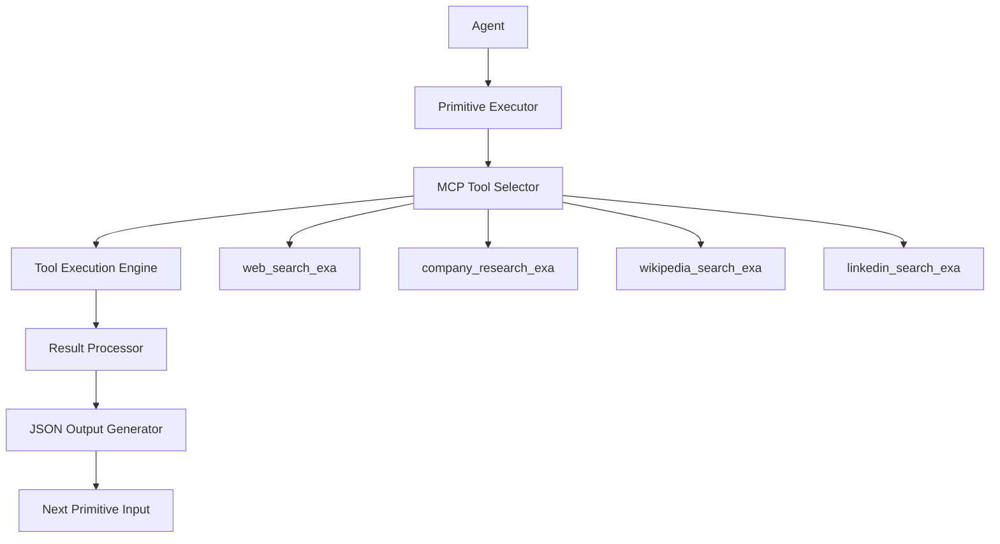

# Retrieval-Orchestration Library: Core Primitives Specification

## Overview

This specification defines the four core primitives that form the foundation of the retrieval-orchestration library. These primitives are designed as Markdown files that agents read and execute, with JSON output embedded in code blocks for composability and chaining.

## Design Philosophy

- **Agent-Readable**: Primitives are documented in Markdown format for natural language understanding
- **Composable**: JSON output enables seamless chaining between primitives
- **Adaptive**: Agentic levels provide varying degrees of autonomy and guidance
- **MCP-Integrated**: Leverages existing MCP tools while providing orchestration patterns

---

## Agentic Level Rubric

The agentic level parameter controls how much autonomy and flexibility agents have when executing primitives:

### Prescriptive (Level 1)
- **Approach**: Sequential, step-by-step instructions
- **Agent Role**: Execute predefined steps in order
- **Output**: Structured, predictable results
- **Use Case**: Reliable, repeatable workflows with minimal variation

### Guided (Level 2)
- **Approach**: Natural language guidelines with suggested approaches
- **Agent Role**: Interpret guidelines and adapt execution
- **Output**: Flexible structure with core requirements met
- **Use Case**: Semi-autonomous execution with guardrails

### Autonomous (Level 3)
- **Approach**: Open-ended objectives with available tools
- **Agent Role**: Full decision-making authority on approach
- **Output**: Creative solutions using available MCP tools
- **Use Case**: Complex problem-solving requiring agent creativity

---

## Core Primitive 1: Querying Primitive

### YAML Frontmatter
```yaml
---
primitive_type: "querying"
version: "1.0.0"
description: "Orchestrates Exa searches with varying levels of agent autonomy"
required_tools:
  - "web_search_exa"
  - "company_research_exa"
  - "wikipedia_search_exa"
  - "linkedin_search_exa"
optional_tools:
  - "reddit_search_exa"
  - "youtube_search_exa"
  - "tiktok_search_exa"
parameters:
  strategy:
    type: "yaml_object"
    description: "Search strategy configuration"
    required: true
  agentic_level:
    type: "enum"
    values: ["prescriptive", "guided", "autonomous"]
    required: true
output_format: "json"
composable: true
---
```

### Primitive Definition

The Querying Primitive orchestrates multiple Exa search tools to gather comprehensive information on a given topic or entity.

#### Parameters

- **strategy** (yaml_object): Defines search approach, target sources, and result requirements
- **agentic_level** (enum): Controls execution autonomy level

#### Strategy Object Structure
```yaml
target: "company_analysis" | "topic_research" | "competitive_intelligence"
sources:
  primary: ["web_search_exa", "company_research_exa"]
  secondary: ["wikipedia_search_exa", "linkedin_search_exa"]
  optional: ["reddit_search_exa", "youtube_search_exa"]
filters:
  date_range: "6_months" | "1_year" | "all_time"
  domains: ["include_list"] | ["exclude_list"]
  content_type: "news" | "research" | "social" | "all"
result_requirements:
  min_sources: 3
  max_results_per_source: 10
  confidence_threshold: 0.7
```

#### Execution by Agentic Level

**Prescriptive Level:**
1. Execute primary sources in specified order
2. Apply exact filters as defined
3. Collect specified number of results
4. Return structured JSON output

**Guided Level:**
- Use strategy as starting point
- Adapt source selection based on initial results
- Apply intelligent filtering based on content quality
- Expand or narrow search scope as needed

**Autonomous Level:**
- Interpret strategy objectives
- Dynamically select optimal tool combinations
- Create custom search approaches
- Iterate and refine based on result quality

#### Output Format
```json
{
  "primitive_type": "querying",
  "execution_id": "query_20250116_001",
  "strategy_used": { /* actual strategy applied */ },
  "agentic_level": "guided",
  "results": {
    "primary_sources": [
      {
        "tool": "web_search_exa",
        "query": "applied_query",
        "results_count": 8,
        "confidence": 0.85,
        "data": [ /* search results */ ]
      }
    ],
    "secondary_sources": [ /* similar structure */ ],
    "synthesis": {
      "total_sources": 4,
      "unique_insights": 12,
      "confidence_score": 0.82,
      "gaps_identified": ["financial_data", "recent_developments"]
    }
  },
  "metadata": {
    "execution_time_ms": 4500,
    "tools_used": ["web_search_exa", "company_research_exa"],
    "next_recommended_primitive": "filtering"
  }
}
```

---

## Core Primitive 2: Filtering Primitive

### YAML Frontmatter
```yaml
---
primitive_type: "filtering"
version: "1.0.0"
description: "General data filtering with flexible rule application"
required_tools: []
optional_tools:
  - "web_search_exa" # for additional context
parameters:
  input_data:
    type: "json"
    description: "Data to be filtered"
    required: true
  filter_rules:
    type: "array"
    description: "Array of filtering rules to apply"
    required: true
  agentic_level:
    type: "enum"
    values: ["prescriptive", "guided", "autonomous"]
    required: true
output_format: "json"
composable: true
---
```

### Primitive Definition

The Filtering Primitive applies sophisticated filtering logic to datasets, with rule interpretation varying by agentic level.

#### Parameters

- **input_data** (json): Source data from previous primitives or external sources
- **filter_rules** (array): Filtering criteria and logic
- **agentic_level** (enum): Controls rule interpretation flexibility

#### Filter Rules Structure
```json
[
  {
    "rule_type": "relevance_threshold",
    "field": "confidence_score",
    "operator": ">=",
    "value": 0.7,
    "priority": "high"
  },
  {
    "rule_type": "content_quality",
    "criteria": ["has_author", "recent_date", "credible_source"],
    "logic": "any",
    "priority": "medium"
  },
  {
    "rule_type": "deduplication",
    "method": "semantic_similarity",
    "threshold": 0.85,
    "priority": "high"
  }
]
```

#### Execution by Agentic Level

**Prescriptive Level:**
- Apply rules exactly as specified
- Use strict boolean logic
- No rule adaptation or interpretation

**Guided Level:**
- Interpret rule intent and adapt thresholds
- Apply contextual understanding to criteria
- Balance competing rule priorities

**Autonomous Level:**
- Create additional rules based on data patterns
- Optimize filtering for downstream use
- Apply advanced ML-based filtering techniques

#### Output Format
```json
{
  "primitive_type": "filtering",
  "execution_id": "filter_20250116_001",
  "input_summary": {
    "total_items": 156,
    "data_types": ["search_results", "company_data"],
    "source_primitives": ["querying"]
  },
  "rules_applied": [
    {
      "rule": { /* original rule */ },
      "items_filtered": 23,
      "effectiveness": 0.89
    }
  ],
  "results": {
    "filtered_data": [ /* processed data */ ],
    "items_retained": 89,
    "items_removed": 67,
    "quality_score": 0.91
  },
  "metadata": {
    "execution_time_ms": 1200,
    "next_recommended_primitive": "aggregation"
  }
}
```

---

## Core Primitive 3: Aggregation Primitive

### YAML Frontmatter
```yaml
---
primitive_type: "aggregation"
version: "1.0.0"
description: "Versatile data combination and summarization"
required_tools: []
optional_tools:
  - "web_search_exa" # for additional context during aggregation
parameters:
  input:
    type: "json"
    description: "Data to be aggregated"
    required: true
  operations:
    type: "array"
    description: "Array of aggregation functions to apply"
    required: true
  agentic_level:
    type: "enum"
    values: ["prescriptive", "guided", "autonomous"]
    required: true
output_format: "json"
composable: true
---
```

### Primitive Definition

The Aggregation Primitive combines and synthesizes data from multiple sources into coherent, actionable insights.

#### Parameters

- **input** (json): Data from previous primitives or multiple sources
- **operations** (array): Aggregation functions and synthesis instructions
- **agentic_level** (enum): Controls synthesis creativity and approach

#### Operations Structure
```json
[
  {
    "operation": "group_by",
    "field": "source_type",
    "sub_operations": ["count", "average_confidence"]
  },
  {
    "operation": "synthesize",
    "method": "thematic_analysis",
    "output_format": "executive_summary",
    "max_length": 500
  },
  {
    "operation": "trend_analysis",
    "time_field": "published_date",
    "metrics": ["sentiment", "volume", "key_topics"]
  },
  {
    "operation": "cross_reference",
    "sources": ["primary", "secondary"],
    "validation_method": "fact_checking"
  }
]
```

#### Execution by Agentic Level

**Prescriptive Level:**
- Execute operations in exact sequence
- Use predefined aggregation methods
- Generate standardized output formats

**Guided Level:**
- Adapt operations based on data characteristics
- Apply domain knowledge to synthesis
- Create contextually appropriate summaries

**Autonomous Level:**
- Design custom aggregation strategies
- Apply advanced analytical techniques
- Generate insights beyond explicit operations

#### Output Format
```json
{
  "primitive_type": "aggregation",
  "execution_id": "agg_20250116_001",
  "input_summary": {
    "sources": 3,
    "total_items": 89,
    "data_span": "2024-07-01 to 2025-01-16"
  },
  "operations_executed": [
    {
      "operation": "synthesize",
      "method_used": "thematic_analysis",
      "themes_identified": 5,
      "confidence": 0.87
    }
  ],
  "results": {
    "executive_summary": "Key findings and insights...",
    "aggregated_metrics": {
      "total_mentions": 234,
      "sentiment_score": 0.72,
      "trend_direction": "positive"
    },
    "thematic_breakdown": [
      {
        "theme": "product_innovation",
        "prevalence": 0.34,
        "sentiment": 0.81,
        "key_points": ["AI integration", "user experience"]
      }
    ],
    "cross_references": {
      "validated_facts": 12,
      "conflicting_information": 2,
      "confidence_score": 0.85
    }
  },
  "metadata": {
    "execution_time_ms": 3200,
    "next_recommended_primitive": "reasoning"
  }
}
```

---

## Core Primitive 4: Reasoning Primitive

### YAML Frontmatter
```yaml
---
primitive_type: "reasoning"
version: "1.0.0"
description: "Structured reasoning with Clear Thought patterns and MCP tool integration"
required_tools: []
optional_tools:
  - "web_search_exa" # for fact verification
  - "wikipedia_search_exa" # for context
parameters:
  input_data:
    type: "json"
    description: "Data to reason about"
    required: true
  reasoning_strategy:
    type: "yaml_object"
    description: "References Clear Thought patterns and reasoning approach"
    required: true
  agentic_level:
    type: "enum"
    values: ["prescriptive", "guided", "autonomous"]
    required: true
output_format: "json"
composable: true
---
```

### Primitive Definition

The Reasoning Primitive provides structured guidance for analytical thinking while allowing agents to choose how to use available MCP reasoning tools.

#### Parameters

- **input_data** (json): Data requiring analysis and reasoning
- **reasoning_strategy** (yaml_object): References Clear Thought patterns and reasoning frameworks
- **agentic_level** (enum): Controls reasoning autonomy and creativity

#### Reasoning Strategy Structure
```yaml
framework: "clear_thought" | "causal_analysis" | "strategic_assessment"
clear_thought_pattern:
  observation: "systematic_data_review"
  hypothesis: "pattern_identification"
  prediction: "outcome_forecasting"
  verification: "fact_checking"
reasoning_objectives:
  - "identify_causal_relationships"
  - "assess_strategic_implications"
  - "evaluate_risk_factors"
  - "generate_actionable_recommendations"
constraints:
  evidence_threshold: 0.8
  reasoning_depth: "deep" | "moderate" | "surface"
  bias_mitigation: true
output_requirements:
  include_reasoning_chain: true
  confidence_levels: true
  alternative_hypotheses: true
```

#### Execution by Agentic Level

**Prescriptive Level:**
- Follow Clear Thought pattern steps sequentially
- Use predefined reasoning templates
- Generate structured logical arguments

**Guided Level:**
- Adapt reasoning approach to data characteristics
- Apply domain-specific reasoning patterns
- Balance multiple reasoning frameworks

**Autonomous Level:**
- Create novel reasoning approaches
- Integrate multiple analytical frameworks
- Generate creative insights and hypotheses

#### Output Format
```json
{
  "primitive_type": "reasoning",
  "execution_id": "reason_20250116_001",
  "strategy_applied": {
    "framework": "clear_thought",
    "pattern_used": "observation_hypothesis_prediction_verification",
    "adaptations": ["domain_specific_context", "multi_source_validation"]
  },
  "reasoning_chain": {
    "observations": [
      {
        "finding": "Market sentiment shows 72% positive trend",
        "evidence": ["source1", "source2"],
        "confidence": 0.85
      }
    ],
    "hypotheses": [
      {
        "hypothesis": "Product innovation driving positive sentiment",
        "supporting_evidence": ["patent_filings", "user_reviews"],
        "confidence": 0.78
      }
    ],
    "predictions": [
      {
        "prediction": "Continued growth in Q2 2025",
        "probability": 0.73,
        "assumptions": ["market_stability", "no_major_disruptions"]
      }
    ],
    "verification": {
      "facts_checked": 8,
      "sources_validated": 5,
      "contradictions_found": 1,
      "overall_reliability": 0.82
    }
  },
  "conclusions": {
    "primary_insights": [
      "Strong market position with innovation advantage",
      "Positive sentiment trend likely to continue"
    ],
    "risk_factors": [
      "Market volatility could impact predictions",
      "Limited data on competitive response"
    ],
    "recommendations": [
      "Monitor competitive landscape closely",
      "Capitalize on current positive momentum"
    ],
    "confidence_score": 0.79
  },
  "metadata": {
    "execution_time_ms": 5600,
    "reasoning_tools_used": ["pattern_analysis", "fact_verification"],
    "next_recommended_action": "implement_recommendations"
  }
}
```

---

## Primitive Composition and Chaining

### Sequential Chaining Pattern
```json
{
  "workflow_id": "comprehensive_analysis_001",
  "primitives_chain": [
    {
      "primitive": "querying",
      "strategy": { /* search strategy */ },
      "agentic_level": "guided",
      "output_feeds_to": "filtering"
    },
    {
      "primitive": "filtering",
      "input_source": "querying.results",
      "filter_rules": [ /* rules */ ],
      "agentic_level": "guided",
      "output_feeds_to": "aggregation"
    },
    {
      "primitive": "aggregation",
      "input_source": "filtering.results.filtered_data",
      "operations": [ /* operations */ ],
      "agentic_level": "autonomous",
      "output_feeds_to": "reasoning"
    },
    {
      "primitive": "reasoning",
      "input_source": "aggregation.results",
      "reasoning_strategy": { /* strategy */ },
      "agentic_level": "autonomous"
    }
  ]
}
```

### Parallel Execution Pattern
```json
{
  "workflow_id": "multi_source_analysis_001",
  "parallel_branches": [
    {
      "branch_id": "financial_analysis",
      "primitives": ["querying", "filtering", "aggregation"],
      "focus": "financial_data"
    },
    {
      "branch_id": "sentiment_analysis", 
      "primitives": ["querying", "filtering", "aggregation"],
      "focus": "social_sentiment"
    }
  ],
  "convergence_primitive": {
    "primitive": "reasoning",
    "input_sources": ["financial_analysis.output", "sentiment_analysis.output"],
    "reasoning_strategy": "multi_source_synthesis"
  }
}
```

### Iterative Refinement Pattern
```json
{
  "workflow_id": "iterative_research_001",
  "iteration_strategy": {
    "max_iterations": 3,
    "convergence_criteria": "confidence_threshold_0.85",
    "refinement_primitive": "querying"
  },
  "base_workflow": ["querying", "filtering", "aggregation", "reasoning"],
  "feedback_loop": {
    "trigger": "reasoning.conclusions.confidence_score < 0.85",
    "action": "refine_querying_strategy",
    "parameters": "reasoning.conclusions.risk_factors"
  }
}
```

---

## MCP Tool Integration Patterns

### Tool Selection by Primitive

**Querying Primitive MCP Tools:**
- [`web_search_exa`](../src/tools/webSearch.ts:10) - General web search
- [`company_research_exa`](../src/tools/companyResearch.ts:10) - Business intelligence
- [`wikipedia_search_exa`](../src/tools/wikipediaSearch.ts:10) - Factual background
- [`linkedin_search_exa`](../src/tools/linkedInSearch.ts:10) - Professional insights
- [`reddit_search_exa`](../src/tools/redditSearch.ts:10) - Community sentiment
- [`youtube_search_exa`](../src/tools/youtubeSearch.ts:10) - Video content analysis

**Filtering Primitive MCP Tools:**
- Optional: [`web_search_exa`](../src/tools/webSearch.ts:10) for context validation

**Aggregation Primitive MCP Tools:**
- Optional: [`web_search_exa`](../src/tools/webSearch.ts:10) for gap filling

**Reasoning Primitive MCP Tools:**
- Optional: [`web_search_exa`](../src/tools/webSearch.ts:10) for fact verification
- Optional: [`wikipedia_search_exa`](../src/tools/wikipediaSearch.ts:10) for context

### Integration Architecture



### Error Handling and Fallbacks

```json
{
  "error_handling": {
    "tool_unavailable": {
      "strategy": "fallback_to_alternative",
      "alternatives": {
        "company_research_exa": ["web_search_exa", "linkedin_search_exa"],
        "reddit_search_exa": ["web_search_exa"]
      }
    },
    "insufficient_results": {
      "strategy": "expand_search_scope",
      "actions": ["broaden_query", "add_secondary_sources", "lower_confidence_threshold"]
    },
    "conflicting_data": {
      "strategy": "multi_source_validation",
      "actions": ["cross_reference", "confidence_weighting", "flag_uncertainties"]
    }
  }
}
```

---

## Implementation Guidelines

### Agent Integration

1. **Primitive Discovery**: Agents read primitive specifications from Markdown files
2. **Parameter Validation**: Validate required parameters before execution
3. **Tool Availability Check**: Verify MCP tools are accessible
4. **Execution Monitoring**: Track primitive execution and performance
5. **Output Validation**: Ensure JSON output conforms to specification

### Performance Optimization

- **Caching**: Cache frequently used query results
- **Parallel Execution**: Execute independent primitives simultaneously
- **Resource Management**: Monitor MCP tool usage and rate limits
- **Result Reuse**: Leverage previous primitive outputs when applicable

### Quality Assurance

- **Confidence Tracking**: Maintain confidence scores throughout pipeline
- **Source Attribution**: Track data provenance across primitives
- **Validation Chains**: Implement cross-validation between primitives
- **Error Propagation**: Handle and communicate errors effectively

---

## Future Extensions

### Planned Primitives

1. **Validation Primitive**: Cross-reference and fact-check results
2. **Transformation Primitive**: Convert between data formats and structures
3. **Notification Primitive**: Alert systems and stakeholders
4. **Storage Primitive**: Persist results and maintain data lineage

### Advanced Features

- **Learning Adaptation**: Primitives learn from execution patterns
- **Dynamic Tool Discovery**: Automatically integrate new MCP tools
- **Workflow Optimization**: AI-driven workflow improvement
- **Multi-Modal Support**: Handle text, images, and structured data

---

## Conclusion

These four core primitives provide a flexible, composable foundation for retrieval-orchestration workflows. By combining structured guidance with agentic autonomy, they enable both reliable automation and creative problem-solving while leveraging the full power of the MCP ecosystem.

The primitives are designed to evolve with the system, supporting increasingly sophisticated workflows while maintaining simplicity and reliability for basic use cases.