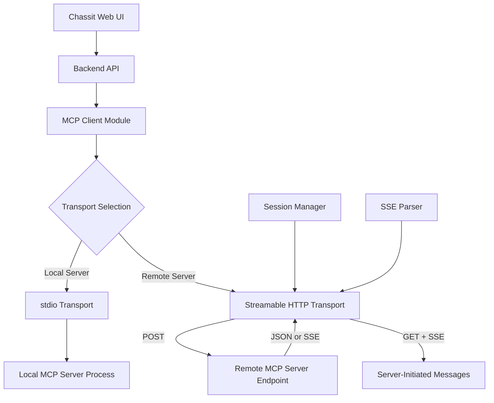

# MCP Streamable HTTP Implementation for Chassit

## Summary
Implementation of an MCP (Model Context Protocol) client for Chassit using the official Streamable HTTP transport as specified in MCP version 2025-06-18. This specification supersedes the previous WebSocket-based approach after research confirmed that WebSockets are not part of the official MCP specification. The implementation will use a single HTTP endpoint with POST requests and optional Server-Sent Events (SSE) for streaming responses, ensuring full compliance with the current MCP standard while maintaining zero external dependencies.

## Problem Statement
The initial MCP client specification (01-mcp-client-integration.md) included a WebSocket-first approach based on incomplete understanding of the MCP specification. Research has revealed that:
- WebSockets are NOT part of the official MCP specification (2025-06-18)
- The official transports are stdio (local) and Streamable HTTP (remote)
- WebSocket support (SEP-1288) is only a proposal under review, not approved
- SSE was deprecated in favor of Streamable HTTP in March 2025

This misalignment creates a risk of building non-compliant implementations that won't interoperate with standard MCP servers. A corrected approach following the official specification is required.

## Rationale
Implementing the official Streamable HTTP transport ensures:
- **Specification Compliance**: Full compatibility with MCP 2025-06-18
- **Ecosystem Compatibility**: Works with all standard MCP servers
- **Future-Proof**: Aligns with the protocol's evolution from SSE to Streamable HTTP
- **Simplicity**: Single endpoint pattern reduces complexity vs old SSE dual-endpoint
- **Zero Dependencies**: Can be implemented with Node.js built-ins only
- **Performance**: Efficient streaming with resumability support

The Streamable HTTP transport represents the protocol maintainers' solution to the limitations of the previous SSE approach, providing better connection management and simplified architecture.

## Requirements

### Functional Requirements
- Implement Streamable HTTP transport per MCP specification 2025-06-18
- Single HTTP endpoint supporting both POST and GET methods
- POST for sending JSON-RPC messages (requests, responses, notifications)
- GET for opening SSE streams to receive server-initiated messages
- Session management via `Mcp-Session-Id` header
- Support for both single JSON responses and SSE streaming
- Resumability support via SSE event IDs and `Last-Event-ID` header
- Protocol version negotiation via `MCP-Protocol-Version` header

### Non-Functional Requirements
- Zero external dependencies (use only Node.js built-in modules)
- Type-safe implementation with Zod schema validation
- Secure by default (Origin validation, localhost binding)
- Graceful degradation and error handling
- Backward compatibility detection for old HTTP+SSE servers
- Performance target: <100ms latency for standard operations

## Non-Goals
- WebSocket transport implementation (not in official spec)
- Custom transport mechanisms (beyond stdio and Streamable HTTP)
- Direct client-to-server communication bypassing backend
- Automatic protocol version negotiation beyond initialization
- Load balancing or connection pooling (single endpoint pattern)

## Architecture

### High-Level Design
The MCP client uses Streamable HTTP as the primary transport for remote servers, with stdio support for local servers:



### Key Components

#### MCP Client Module (`packages/api/mcp/client.mts`)
```typescript
class MCPClient {
  private transport: MCPTransport;
  private sessionId?: string;

  constructor(config: MCPConfig) {
    this.transport = config.url
      ? new StreamableHTTPTransport(config.url)
      : new StdioTransport(config.command);
  }

  async initialize(): Promise<InitializeResult> {
    const result = await this.transport.request('initialize', {
      protocolVersion: '2025-06-18',
      capabilities: { /* ... */ }
    });

    // Extract session ID if provided
    if (this.transport instanceof StreamableHTTPTransport) {
      this.sessionId = this.transport.getSessionId();
    }

    return result;
  }

  async invokeTool(name: string, args: any): Promise<any> {
    return this.transport.request('tools/call', { name, arguments: args });
  }

  async readResource(uri: string): Promise<any> {
    return this.transport.request('resources/read', { uri });
  }
}
```

#### Streamable HTTP Transport (`packages/api/mcp/transports/streamable-http.mts`)
```typescript
class StreamableHTTPTransport implements MCPTransport {
  private endpoint: string;
  private sessionId?: string;
  private sseStream?: EventSource;
  private lastEventId?: string;

  constructor(endpoint: string) {
    this.endpoint = endpoint;
  }

  async request(method: string, params?: any): Promise<any> {
    const response = await fetch(this.endpoint, {
      method: 'POST',
      headers: {
        'Content-Type': 'application/json',
        'Accept': 'application/json, text/event-stream',
        'MCP-Protocol-Version': '2025-06-18',
        ...(this.sessionId && { 'Mcp-Session-Id': this.sessionId }),
        ...(this.lastEventId && { 'Last-Event-ID': this.lastEventId })
      },
      body: JSON.stringify({
        jsonrpc: '2.0',
        id: generateId(),
        method,
        params
      })
    });

    // Extract session ID from initialization
    if (method === 'initialize') {
      this.sessionId = response.headers.get('Mcp-Session-Id') || undefined;
    }

    const contentType = response.headers.get('content-type');

    if (contentType?.includes('text/event-stream')) {
      // Handle SSE stream
      return this.handleSSEResponse(response);
    } else if (contentType?.includes('application/json')) {
      // Handle single JSON response
      return response.json();
    } else if (response.status === 202) {
      // Accepted notification/response
      return null;
    } else {
      throw new Error(`Unexpected response: ${response.status}`);
    }
  }

  private async handleSSEResponse(response: Response): Promise<any> {
    return new Promise((resolve, reject) => {
      const reader = response.body?.getReader();
      const decoder = new TextDecoder();
      let buffer = '';

      const processLine = (line: string) => {
        if (line.startsWith('data: ')) {
          const data = line.slice(6);
          const message = JSON.parse(data);

          if (message.id && message.result !== undefined) {
            // This is the response we're waiting for
            resolve(message.result);
          }
        } else if (line.startsWith('id: ')) {
          this.lastEventId = line.slice(4);
        }
      };

      // Read SSE stream
      const readStream = async () => {
        try {
          while (true) {
            const { done, value } = await reader!.read();
            if (done) break;

            buffer += decoder.decode(value, { stream: true });
            const lines = buffer.split('\n');
            buffer = lines.pop() || '';

            for (const line of lines) {
              if (line.trim()) processLine(line.trim());
            }
          }
        } catch (error) {
          reject(error);
        }
      };

      readStream();
    });
  }

  async openNotificationStream(): Promise<void> {
    const response = await fetch(this.endpoint, {
      method: 'GET',
      headers: {
        'Accept': 'text/event-stream',
        'MCP-Protocol-Version': '2025-06-18',
        ...(this.sessionId && { 'Mcp-Session-Id': this.sessionId }),
        ...(this.lastEventId && { 'Last-Event-ID': this.lastEventId })
      }
    });

    if (!response.ok || !response.headers.get('content-type')?.includes('event-stream')) {
      throw new Error('Server does not support notification streams');
    }

    // Process SSE stream for server-initiated messages
    await this.handleSSEResponse(response);
  }

  async close(): Promise<void> {
    if (this.sessionId) {
      await fetch(this.endpoint, {
        method: 'DELETE',
        headers: {
          'Mcp-Session-Id': this.sessionId
        }
      });
    }
  }
}
```

#### stdio Transport (`packages/api/mcp/transports/stdio.mts`)
```typescript
import { spawn, ChildProcess } from 'child_process';
import { EventEmitter } from 'events';

class StdioTransport extends EventEmitter implements MCPTransport {
  private process?: ChildProcess;
  private buffer: string = '';

  constructor(private command: string, private args: string[] = []) {
    super();
  }

  async connect(): Promise<void> {
    this.process = spawn(this.command, this.args);

    this.process.stdout?.on('data', (data) => {
      this.buffer += data.toString();
      this.processBuffer();
    });

    this.process.stderr?.on('data', (data) => {
      console.error('MCP Server:', data.toString());
    });
  }

  private processBuffer(): void {
    const lines = this.buffer.split('\n');
    this.buffer = lines.pop() || '';

    for (const line of lines) {
      if (line.trim()) {
        try {
          const message = JSON.parse(line);
          this.emit('message', message);
        } catch (error) {
          console.error('Invalid JSON:', line);
        }
      }
    }
  }

  async request(method: string, params?: any): Promise<any> {
    const id = generateId();
    const message = {
      jsonrpc: '2.0',
      id,
      method,
      params
    };

    return new Promise((resolve, reject) => {
      const handler = (msg: any) => {
        if (msg.id === id) {
          this.off('message', handler);
          if (msg.error) {
            reject(new Error(msg.error.message));
          } else {
            resolve(msg.result);
          }
        }
      };

      this.on('message', handler);
      this.process?.stdin?.write(JSON.stringify(message) + '\n');
    });
  }

  async close(): Promise<void> {
    this.process?.stdin?.end();
    this.process?.kill();
  }
}
```

### Schema Extensions (`packages/shared/src/schemas/mcp.mts`)
```typescript
import { z } from 'zod';

// JSON-RPC 2.0 base schemas
export const JsonRpcRequestSchema = z.object({
  jsonrpc: z.literal('2.0'),
  id: z.union([z.string(), z.number()]),
  method: z.string(),
  params: z.any().optional()
});

export const JsonRpcResponseSchema = z.object({
  jsonrpc: z.literal('2.0'),
  id: z.union([z.string(), z.number()]),
  result: z.any().optional(),
  error: z.object({
    code: z.number(),
    message: z.string(),
    data: z.any().optional()
  }).optional()
});

export const JsonRpcNotificationSchema = z.object({
  jsonrpc: z.literal('2.0'),
  method: z.string(),
  params: z.any().optional()
});

// MCP-specific schemas
export const MCPInitializeRequestSchema = z.object({
  protocolVersion: z.string(),
  capabilities: z.object({
    tools: z.object({}).optional(),
    resources: z.object({}).optional(),
    prompts: z.object({}).optional()
  }),
  clientInfo: z.object({
    name: z.string(),
    version: z.string()
  })
});

export const MCPTransportConfigSchema = z.discriminatedUnion('type', [
  z.object({
    type: z.literal('stdio'),
    command: z.string(),
    args: z.array(z.string()).optional()
  }),
  z.object({
    type: z.literal('streamable-http'),
    url: z.string().url(),
    headers: z.record(z.string()).optional()
  })
]);
```

### Backward Compatibility Detection
```typescript
async function detectTransportType(url: string): Promise<'streamable' | 'legacy-sse'> {
  try {
    // Try Streamable HTTP first
    const response = await fetch(url, {
      method: 'POST',
      headers: {
        'Content-Type': 'application/json',
        'Accept': 'application/json, text/event-stream',
        'MCP-Protocol-Version': '2025-06-18'
      },
      body: JSON.stringify({
        jsonrpc: '2.0',
        id: 1,
        method: 'initialize',
        params: { protocolVersion: '2025-06-18' }
      })
    });

    if (response.ok) {
      return 'streamable';
    }
  } catch (error) {
    // Ignore and try legacy
  }

  try {
    // Try legacy SSE endpoint
    const response = await fetch(url, {
      method: 'GET',
      headers: { 'Accept': 'text/event-stream' }
    });

    if (response.ok && response.headers.get('content-type')?.includes('event-stream')) {
      // Check for endpoint event (legacy SSE indicator)
      return 'legacy-sse';
    }
  } catch (error) {
    // Ignore
  }

  throw new Error('Unable to detect MCP transport type');
}
```

## Implementation Plan

### Phase 1: Core Transport Implementation (Week 1)
- Implement StreamableHTTPTransport with zero dependencies
- Implement StdioTransport for local servers
- Create transport factory with auto-detection
- Add comprehensive Zod schemas
- Unit tests for both transports

### Phase 2: Protocol Features (Week 2)
- Session management with Mcp-Session-Id
- Resumability support with Last-Event-ID
- Server-initiated message streams (GET + SSE)
- Backward compatibility detection
- Integration tests with mock servers

### Phase 3: Integration & Polish (Week 3)
- WebSocket channel integration (proxy pattern)
- Settings UI for server configuration
- Connection health monitoring
- Error handling and retry logic
- End-to-end tests with real MCP servers

## Risks & Mitigations

| Risk | Impact | Mitigation |
|------|--------|------------|
| SSE parsing complexity | Implementation bugs | Use proven SSE parsing patterns, extensive testing |
| Session management overhead | Added complexity | Clear session lifecycle, automatic recovery |
| Backward compatibility | Legacy server support | Auto-detection with fallback to old transport |
| Network interruptions | Lost messages | Resumability via event IDs, connection recovery |
| Protocol version mismatch | Incompatibility | Version negotiation during initialization |

## Success Metrics
- **Specification Compliance**: 100% conformance with MCP 2025-06-18
- **Zero Dependencies**: No external packages required
- **Performance**: <100ms latency for standard operations
- **Reliability**: 99.9% uptime with automatic recovery
- **Compatibility**: Works with all standard MCP servers
- **Developer Experience**: Clear APIs with TypeScript support

## Minimal-Deviation Register (Virgil 3%)

### Changes Made
- **Transport Implementation**: New Streamable HTTP transport (required by spec)
- **Session Management**: Added Mcp-Session-Id handling (new in spec)
- **SSE Processing**: Custom SSE parser for zero dependencies

### Preserved Patterns
- **Module Structure**: Same organization as existing Chassit modules
- **WebSocket Channels**: Existing infrastructure unchanged
- **Error Handling**: Uses established patterns
- **Type Safety**: Leverages existing Zod setup
- **Testing Approach**: Follows current test patterns

### Why These Changes
The Streamable HTTP transport is mandated by the MCP specification and cannot be avoided. All changes are minimal additions that extend rather than replace existing systems. The implementation maintains Chassit's architectural patterns while adding required MCP compliance.

## Migration Path from Previous Specification

### From WebSocket Approach (01-mcp-client-integration.md)
1. **Replace WebSocket transport** with StreamableHTTPTransport
2. **Remove WebSocket-specific logic** from channel handlers
3. **Update connection patterns** to use HTTP endpoints
4. **Preserve channel-based API** for backward compatibility

### Code Migration Example
```typescript
// Old (WebSocket-based)
const transport = new WebSocketToHttpTransport(wsUrl);

// New (Streamable HTTP)
const transport = new StreamableHTTPTransport(httpUrl);
// API remains the same
```

## References
- [MCP Specification 2025-06-18](https://modelcontextprotocol.io/specification/2025-06-18)
- [Streamable HTTP Transport](https://modelcontextprotocol.io/specification/2025-06-18/basic/transports#streamable-http)
- [Original Integration Report](../../reports/mcp-client-integration.md)
- [Previous Specification](./01-mcp-client-integration.md)
- [SSE Specification](https://html.spec.whatwg.org/multipage/server-sent-events.html)
- [JSON-RPC 2.0 Specification](https://www.jsonrpc.org/specification)